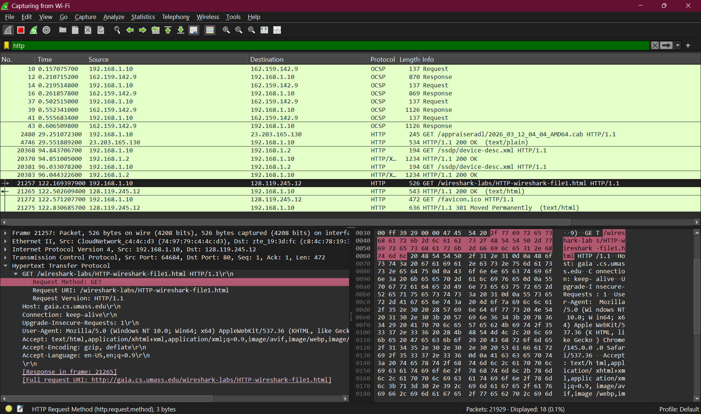
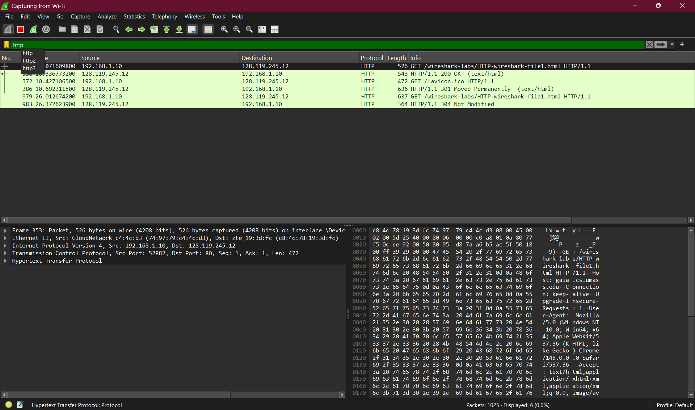

# Laporan Praktikum Week 2

Langkah yang dilakukan

Membuka Wireshark lalu memilih Wi-Fi untuk mulai menangkap paket jaringan.

Setelah capture dimulai, membuka link di browser:

[http://gaia.cs.umass.edu/wireshark-labs/HTTP-wireshark-file1.html](http://gaia.cs.umass.edu/wireshark-labs/HTTP-wireshark-file1.html)

Setelah halaman terbuka, kembali ke Wireshark lalu menghentikan capture.

Menggunakan filter http untuk menampilkan paket HTTP.

Setelah filter digunakan, terlihat paket dari website yang tadi dibuka.

Pada percobaan pertama muncul status **200 OK**. Artinya server berhasil mengirim halaman web ke browser.

Ketika halaman dibuka lagi, muncul status **304 Not Modified**. Ini terjadi karena halaman sudah tersimpan di cache browser, jadi server tidak mengirim ulang file tersebut.

Kesimpulan

Wireshark dapat digunakan untuk melihat aktivitas jaringan saat membuka website.

Status 200 OK berarti halaman web berhasil dikirim oleh server.

Status **304 Not Modified** berarti halaman tidak berubah dan browser menggunakan file yang sudah tersimpan di cache.
