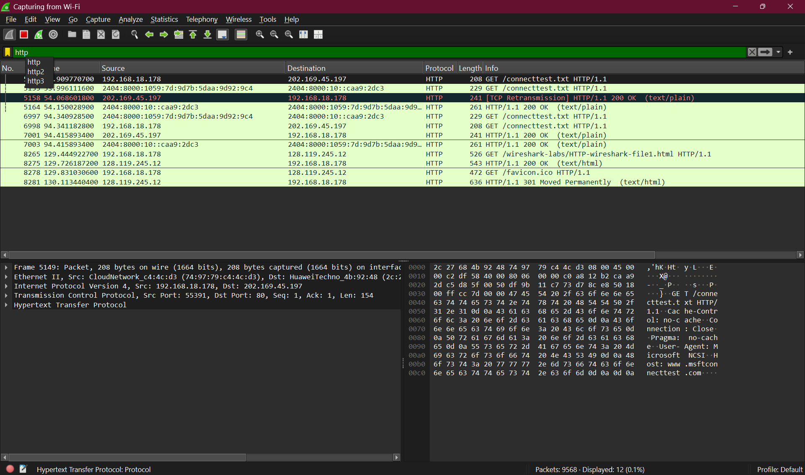
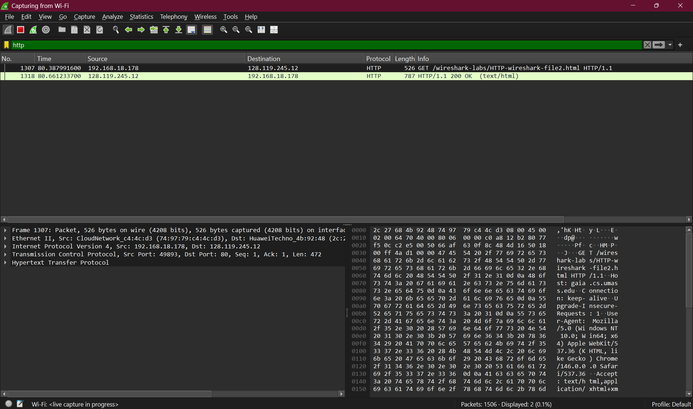
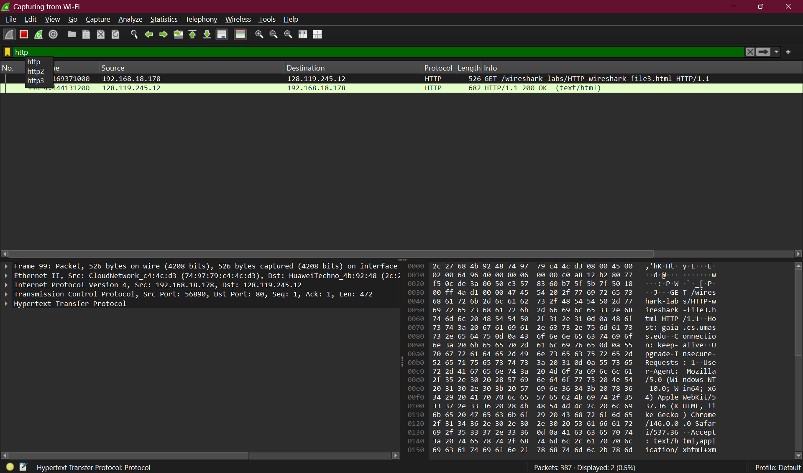
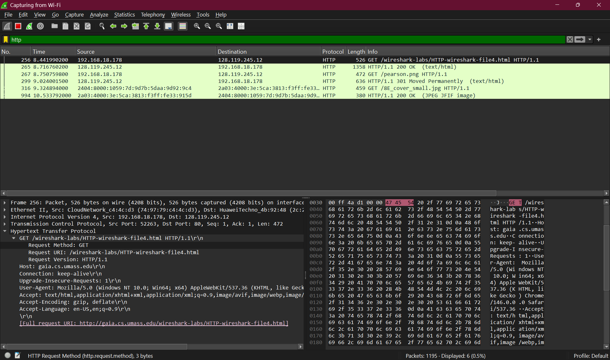
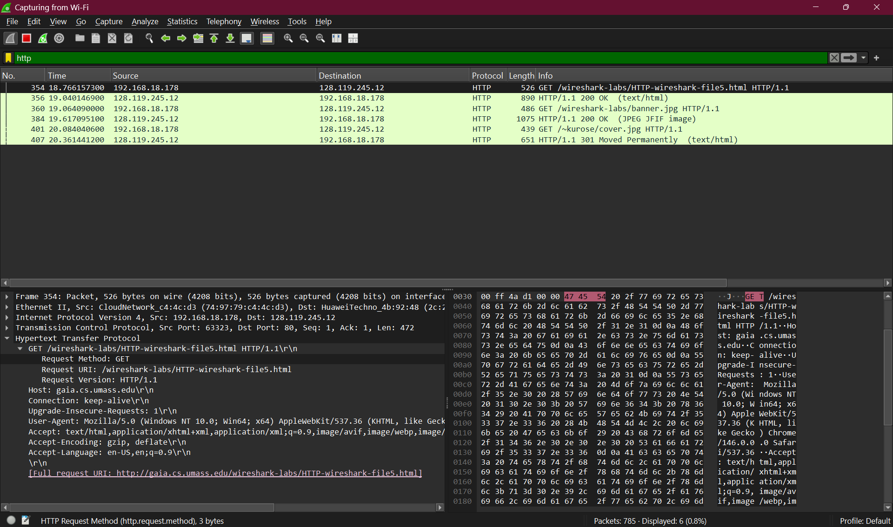

# Analisis Protokol HTTP - Wireshark

## Identitas

Nama: Keisha Hananta
NIM: 103072400149
Kelas: IF-04-01

---

## Tujuan

Memahami cara kerja HTTP menggunakan Wireshark, termasuk:

* GET dan response
* Caching (Conditional GET)
* Pengiriman data besar
* Objek tambahan pada halaman
* Autentikasi HTTP

---

## Dasar Teori

HTTP adalah protokol untuk komunikasi antara browser dan server. Cara kerjanya adalah client mengirim request, lalu server memberi response.

Beberapa hal penting:

* GET digunakan untuk meminta data
* Conditional GET untuk menghindari download ulang
* Data besar dibagi menjadi beberapa bagian oleh TCP
* Satu halaman bisa memuat banyak objek
* Autentikasi HTTP menggunakan encoding Base64

---

## Metode

### 3.1 Basic HTTP GET/Response

1. Hapus cache browser terlebih dahulu
2. Jalankan Wireshark lalu gunakan filter `http`
3. Buka link:
   http://gaia.cs.umass.edu/wireshark-labs/HTTP-wireshark-file1.html
4. Stop capture lalu lihat hasilnya di Wireshark

Penjelasan:
Browser mengirim request GET ke server, lalu server membalas dengan response 200 OK. Ini adalah proses dasar HTTP.

---

### 3.2 Conditional GET

1. Hapus cache browser
2. Jalankan Wireshark
3. Buka link:
   http://gaia.cs.umass.edu/wireshark-labs/HTTP-wireshark-file2.html
4. Refresh halaman (akses lagi)
5. Lihat hasil di Wireshark

Penjelasan:
Saat akses kedua, browser tidak langsung download ulang. Browser mengirim informasi waktu terakhir (If-Modified-Since).
Jika tidak ada perubahan, server balas 304 Not Modified.

---

### 3.3 Mengambil Dokumen Besar

1. Hapus cache browser
2. Buka link:
   http://gaia.cs.umass.edu/wireshark-labs/HTTP-wireshark-file3.html
3. Lihat paket di Wireshark

Penjelasan:
Data yang besar tidak dikirim sekaligus, tapi dibagi menjadi beberapa bagian oleh TCP.
Di Wireshark terlihat sebagai beberapa paket.

---

### 3.4 HTML dengan Gambar (Embedded Objects)

1. Hapus cache browser
2. Buka link:
   http://gaia.cs.umass.edu/wireshark-labs/HTTP-wireshark-file4.html
3. Lihat jumlah request di Wireshark

Penjelasan:
Satu halaman tidak hanya 1 request.
HTML utama + gambar = beberapa request HTTP.

---

### 3.5 HTTP Authentication

1. Hapus cache browser
2. Buka link:
   http://gaia.cs.umass.edu/wireshark-labs/protected_pages/HTTP-wireshark-file5.html
3. Masukkan:
   username: wireshark-students
   password: network
4. Lihat hasil di Wireshark

Penjelasan:
Awalnya server menolak akses (401).
Setelah login, browser kirim data login dalam bentuk encoded (Base64).
Ini tidak aman kalau tidak pakai HTTPS.

---

## Kesimpulan

* Wireshark membantu melihat proses HTTP
* HTTP tidak menyimpan status
* TCP membagi data besar
* Satu halaman bisa memicu banyak request
* HTTP Basic Auth kurang aman tanpa HTTPS

---
