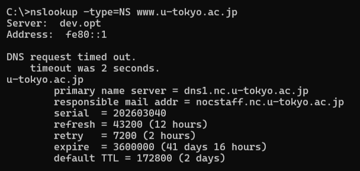
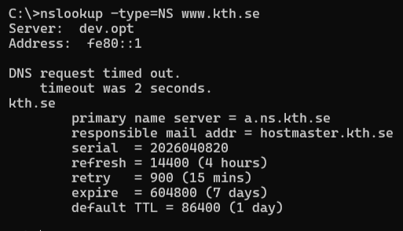
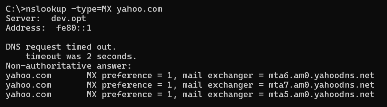
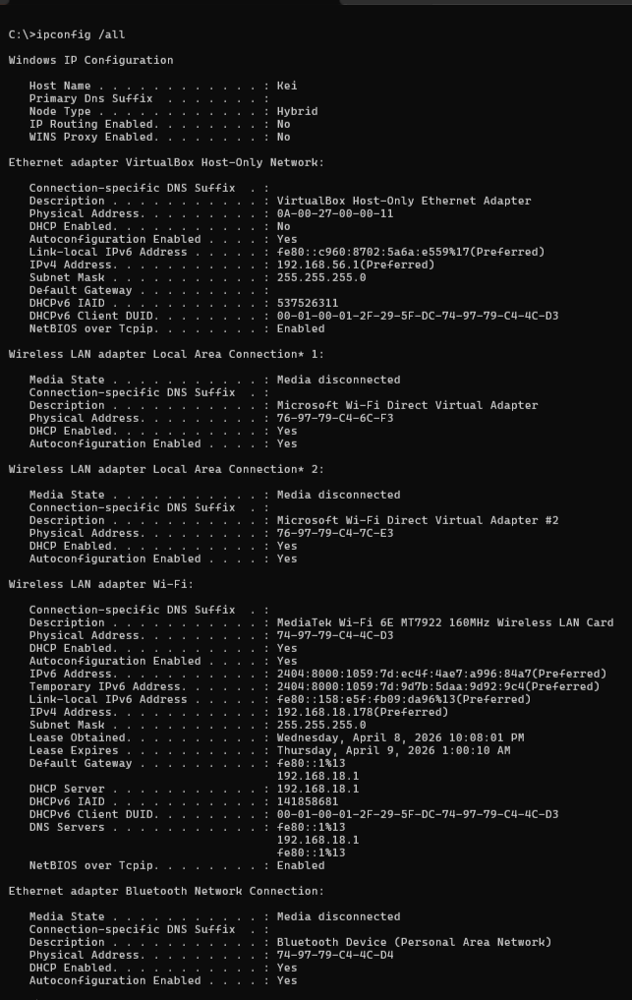
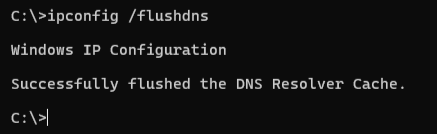
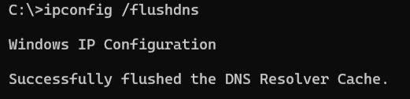
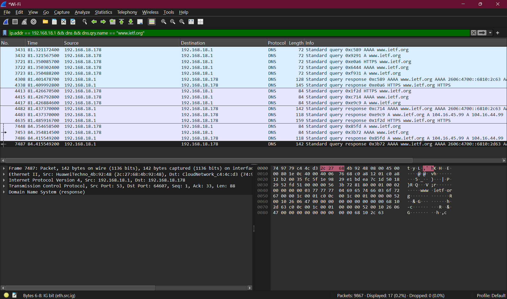
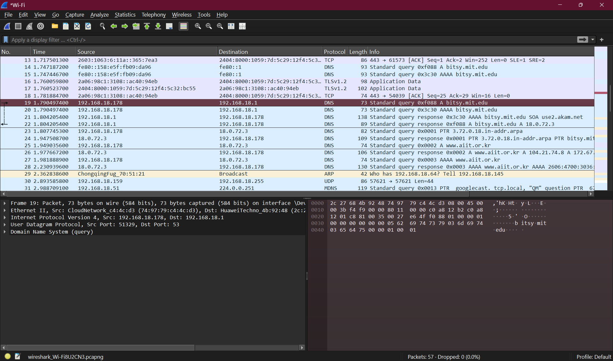

# Analisis Protokol DNS - Wireshark

## Identitas

Nama: Keisha Hananta  
NIM: 103072400149  
Kelas: IF-04-01  

---

## 4.1 Pengantar

DNS (Domain Name System) berfungsi untuk menerjemahkan nama domain menjadi alamat IP.  
Client akan mengirim permintaan ke server DNS dan menerima balasan berupa alamat IP.  

---

## 4.2 Nslookup

### Perintah 1: Mencari IP domain

```bash
nslookup www.mit.edu
```


---

### Perintah 2: Mencari DNS server otoritatif

```bash
nslookup -type=NS mit.edu
```

---

### Perintah 3: Query ke DNS tertentu

```bash
nslookup www.aiit.or.kr bitsy.mit.edu
```


---
### Analisa

#### 1. Web Asia (Tokyo)

```bash
nslookup -type=NS www.u-tokyo.ac.jp
```



Hasil:
Server DNS untuk domain tersebut adalah:
- dns1.nc.u-tokyo.ac.jp  

---

#### 2. Web Eropa (Sweden)

```bash
nslookup -type=NS www.kth.se
```



Hasil:
Server DNS otoritatif:
- a.ns.kth.se  

---

#### 3. Server Email Yahoo Mail

Percobaan menggunakan DNS dari Sweden:

```bash
nslookup -type=MX yahoo.com a.ns.kth.se
```


Hasil:
Query ditolak (**query refused**) karena server DNS tersebut tidak melayani permintaan dari luar domainnya.

---

Percobaan menggunakan DNS default:

```bash
nslookup -type=MX yahoo.com
```



Hasil:
Mail server Yahoo:
- mta5.am0.yahoodns.net  
- mta6.am0.yahoodns.net  
- mta7.am0.yahoodns.net  

Salah satu alamat IP server email Yahoo:
- **98.136.96.74** (contoh hasil lookup)

---

## 4.3 Ipconfig

### Menampilkan informasi jaringan

```bash
ipconfig /all
```



---

### Menampilkan cache DNS

```bash
ipconfig /displaydns
```


---

### Menghapus cache DNS

```bash
ipconfig /flushdns
```



---

## 4.4 Tracing DNS dengan Wireshark

### Langkah 1: Bersihkan DNS cache

```bash
ipconfig /flushdns
```



---

### Langkah 2: Jalankan Wireshark dan set filter

```
ip.addr == [IP address]
```


---

### Langkah 3: Start capture lalu akses website

```
http://www.ietf.org
```


---

### Langkah 4: Stop capture dan filter DNS

```
dns
```



---

### Langkah 5: Nslookup dengan Wireshark

```bash
nslookup www.mit.edu
```


---

### Langkah 6: Nslookup type NS

```bash
nslookup -type=NS mit.edu
```


---

### Langkah 7: Nslookup ke server tertentu

```bash
nslookup www.aiit.or.kr bitsy.mit.edu
```



---
---

### Analisa 4.4.1

#### 1. Apakah DNS menggunakan UDP atau TCP?

DNS menggunakan **UDP**, terlihat pada detail paket:
User Datagram Protocol (UDP)

---

#### 2. Port tujuan dan port sumber

- Port tujuan: **53**  
- Port sumber: **random** (contoh: 51329 / 64607)

---

#### 3. Alamat IP tujuan DNS

- IP tujuan DNS: **192.168.18.1**  
- IP DNS lokal (ipconfig): **192.168.18.1**

Kesimpulan:  
Keduanya sama, berarti request dikirim ke DNS server lokal.

---

#### 4. Type DNS request

Type yang digunakan:
- **A** (IPv4)  
- **AAAA** (IPv6)

Apakah ada answer di request?  
Tidak ada, karena ini hanya query.

---

#### 5. Jumlah dan isi DNS response

Response berisi beberapa jawaban:

- A record: **104.16.45.99**  
- A record: **104.16.44.99**  
- AAAA record: **2606:4700:6810:...**

Kesimpulan:  
DNS response berisi beberapa alamat IP dari domain.

---

#### 6. Apakah IP TCP SYN sesuai dengan DNS?

Ya, sesuai.  
Setelah DNS response, host mengirim TCP SYN ke IP hasil DNS tersebut.

---

#### 7. Apakah perlu DNS request ulang untuk setiap gambar?

Tidak perlu.  

Karena DNS menggunakan cache, sehingga IP bisa dipakai ulang.

---

### Analisa 4.4.2

#### 1. Port tujuan dan port sumber

- Port tujuan: **53**  
- Port sumber pada balasan: **53**

---

#### 2. Alamat IP tujuan DNS

Pesan permintaan DNS dikirim ke:
- **fe80::1** (IPv6 DNS lokal)

Kesimpulan:  
Ya, alamat tersebut merupakan **default DNS server lokal**.

---

#### 3. Type DNS request

Type yang digunakan:
- **A** (IPv4)
- **AAAA** (IPv6)

Apakah ada answer di request?  
Tidak ada, karena ini hanya permintaan (query).

---

#### 4. Jumlah dan isi DNS response

Terdapat beberapa jawaban (answers), yaitu:

- CNAME: **www.mit.edu.edgekey.net**  
- CNAME: **e9566.dscb.akamaiedge.net**  
- A / AAAA record: alamat IP dari server tujuan  

Kesimpulan:  
DNS response berisi beberapa record (CNAME dan IP address).

---

#### 5. Hasil tangkapan layar


---

### Analisa 4.4.3

#### 1. Alamat IP tujuan DNS

Pesan permintaan DNS dikirim ke:
- **fe80::1**

Kesimpulan:  
Ya, alamat tersebut merupakan **default DNS server lokal**.

---

#### 2. Type DNS request

Type yang digunakan:
- **NS** (Name Server)

Apakah ada answer di request?  
 Tidak ada, karena ini hanya permintaan (query).

---

#### 3. Hasil DNS response

Server MIT yang ditemukan:

- **use5.akam.net**  
- **eur5.akam.net**  
- (dan server lain dari Akamai)

Apakah ada alamat IP?  
 Ya, response juga menyertakan alamat IP dari server tersebut.

Kesimpulan:  
DNS response berisi daftar **name server (NS)** dan juga IP address-nya.

---

#### 4. Hasil tangkapan layar


---

### Analisa 4.4.4

#### 1. Alamat IP tujuan DNS

Pesan permintaan DNS dikirim ke:
- **bitsy.mit.edu** (server DNS yang ditentukan)

Kesimpulan:  
Alamat ini **bukan default DNS lokal**, karena kita secara manual menentukan server DNS tujuan.

---

#### 2. Type DNS request

Type yang digunakan:
- **A** (mencari alamat IPv4)

Apakah ada answer di request?  
Tidak ada, karena ini hanya permintaan (query).

---

#### 3. Hasil DNS response

Jumlah jawaban:  
Terdapat beberapa jawaban

Isi jawaban:
- Alamat IP dari domain **www.aiit.or.kr**
- Bisa berupa:
  - A record (IPv4)
  - atau tambahan record lain (tergantung hasil)

Kesimpulan:  
DNS response berisi alamat IP dari domain yang diminta.

---

#### 4. Hasil tangkapan layar


---