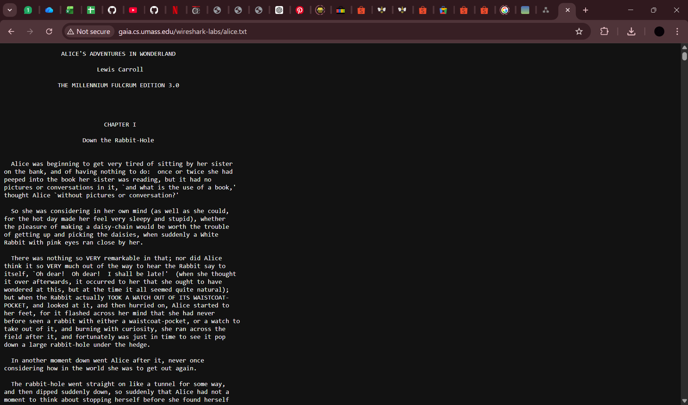
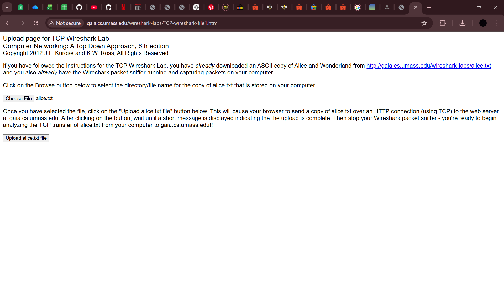
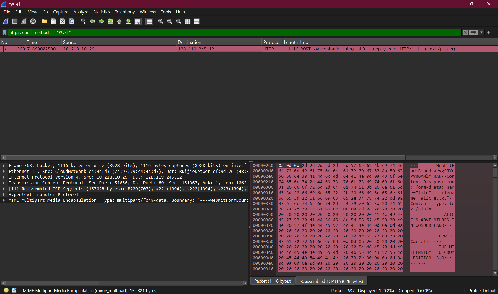
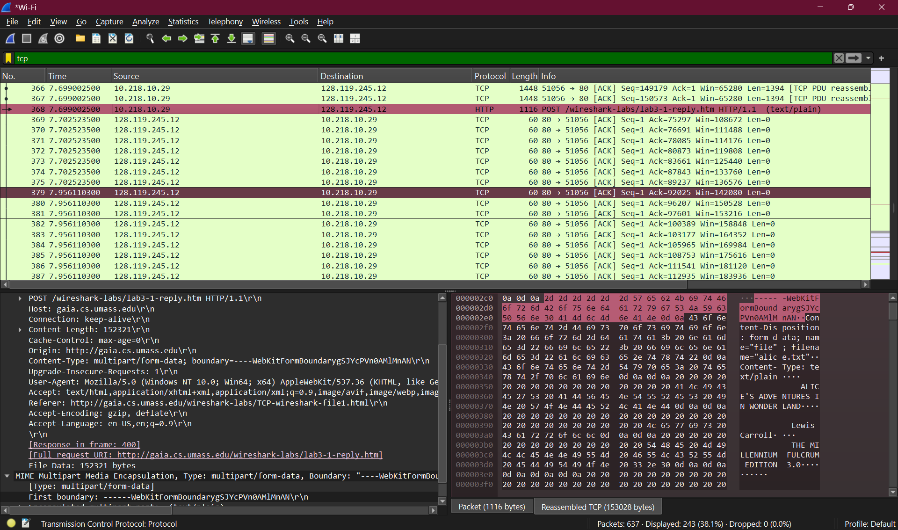

# TCP

## Identitas

Nama: Keisha Hananta  
NIM: 103072400149  
Kelas: IF-04-01  

---

## Tujuan

Tujuan Praktikum:

Memahami cara kerja protokol TCP (Transmission Control Protocol)  
Menganalisis komunikasi HTTP yang berjalan di atas TCP menggunakan Wireshark  
Mengidentifikasi alamat IP dan port pada komunikasi client-server  
Memahami proses pengiriman data (upload) melalui TCP  

---

## Dasar Teori

TCP (Transmission Control Protocol) merupakan protokol pada layer transport yang bersifat:

Connection-oriented (harus membangun koneksi terlebih dahulu)  
Reliable (menjamin data sampai ke tujuan)  
Menggunakan mekanisme kontrol seperti acknowledgment dan retransmission  

TCP memiliki karakteristik:

Menggunakan Sequence Number dan Acknowledgment  
Melakukan Three-way Handshake (SYN, SYN-ACK, ACK)  
Melakukan segmentasi data menjadi beberapa bagian  

Dalam komunikasi HTTP:

Client mengirim request ke server  
Server mengirim response ke client  
Server HTTP umumnya menggunakan port 80  

---

## Metode

Langkah-langkah yang dilakukan:

Membuka Wireshark  
Memilih interface jaringan (Wi-Fi)  
Memulai capture paket  

Membuka website:
http://gaia.cs.umass.edu/wireshark-labs/alice.txt  

Membuka:
http://gaia.cs.umass.edu/wireshark-labs/TCP-wireshark-file1.html  

Melakukan upload file alice.txt  

Menghentikan capture  

Memfilter paket menggunakan: http

Kemudian filter: tcp

---

## Hasil Analisis

## 1. Alamat IP dan port TCP client

Dari hasil analisis:

IP Client = 10.218.10.29  
Port Client = 51056  

Client menggunakan port sementara (ephemeral port) untuk komunikasi  

---

## 2. Alamat IP dan port server

Dari hasil analisis:

IP Server = 128.119.245.12  
Port Server = 80  

Port 80 digunakan untuk layanan HTTP  

---

## 3. Alamat IP dan port TCP client (konfirmasi)

Dari koneksi yang sama:

IP Client = 10.218.10.29  
Port Client = 51056  

Port ini tetap digunakan selama koneksi berlangsung   

---

## Kesimpulan

TCP merupakan protokol yang andal karena menjamin pengiriman data  
Komunikasi terjadi antara client dan server menggunakan IP dan port tertentu  
Client menggunakan port acak (ephemeral port)  
Server HTTP menggunakan port 80  

TCP mampu mengirim data besar dengan cara membaginya menjadi beberapa segmen  
dan menyusunnya kembali di sisi penerima  

---

# Analisis TCP - Modul 6 (Versi Sederhana)

## 1. Segmen TCP SYN
- Paket: 516  
- Sequence number: 0  
- Digunakan untuk memulai koneksi  
- Ciri: ada tulisan [SYN]

---

## 2. Segmen TCP SYNACK
- Paket: 523  
- Sequence number: 0  
- Acknowledgment: 1  
- Balasan dari server  
- Ciri: ada [SYN, ACK]

---

## 3. Segmen HTTP POST
- Paket: 1014  
- Ini adalah saat file dikirim ke server  
- Berisi perintah: POST  

---

## 4. RTT (waktu bolak-balik data)
- Waktu kirim: 27.425278700  
- Waktu diterima: 27.425587100  

RTT:
0.0003084 detik (~0.308 ms)

Artinya koneksi sangat cepat dan stabil  

---

## 5. Panjang segmen
- Sekitar: 1400 byte per segmen  
- Segmen pertama (POST): 1291 byte  

---

## 6. Window size (buffer)
- Sekitar: 64000 byte  

Artinya:
- Buffer besar  
- Tidak menghambat pengiriman  

---

## 7. Retransmission
- Ada retransmission  
- Artinya ada paket yang dikirim ulang  

---

## 8. ACK (balasan data)
- Biasanya mengakui sekitar 1400 byte  
- Di sini ACK bersifat gabungan (cumulative)  

---

## 9. Throughput (kecepatan transfer)
- Total data: 152308 byte  
- Waktu: ±2 detik  

Throughput:
≈ 76154 byte/s (~74 KB/s)

---

## Kesimpulan
- TCP memulai koneksi dengan SYN → SYNACK → ACK  
- Data dikirim bertahap (tidak langsung besar)  
- Ada sistem ACK untuk memastikan data sampai  
- Koneksi stabil (RTT kecil)  
- Tidak ada hambatan dari buffer  

# Analisis Time-Sequence Graph (TCP) - Sederhana

## 1. Slow Start & Congestion Avoidance

Dari grafik Sequence Number vs Time:

- **Awal grafik naik cepat (curam)**
  → Ini fase **slow start**
  → TCP mengirim data makin banyak dengan cepat

- **Setelah itu naik lebih pelan (lebih landai)**
  → Ini fase **congestion avoidance**
  → TCP mulai lebih hati-hati supaya tidak overload jaringan

- **Bagian datar (flat)**
  → Tidak ada data yang dikirim
  → Bisa karena menunggu ACK atau data sudah selesai

### Catatan
Grafik tidak selalu mulus seperti teori karena:
- delay jaringan
- proses ACK
- ukuran file tidak terlalu besar

---

## 2. Analisis dari trace sendiri

Berdasarkan grafik yang didapat:

- **Slow start** terjadi di awal saat grafik naik cepat  
- **Congestion avoidance** terjadi setelahnya saat kenaikan lebih stabil  
- Grafik cepat menjadi **datar** karena data sudah selesai dikirim  

### Kesimpulan
- TCP tetap mengikuti mekanisme:
  - slow start
  - congestion avoidance
- Tapi di kondisi nyata, grafik tidak selalu sempurna seperti teori