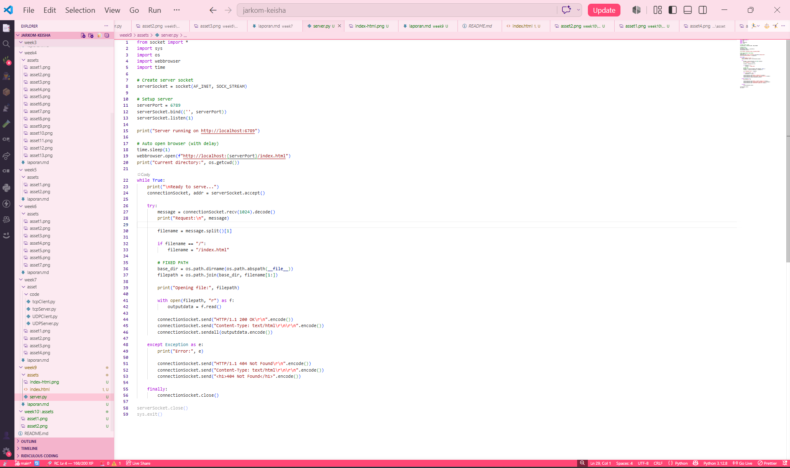
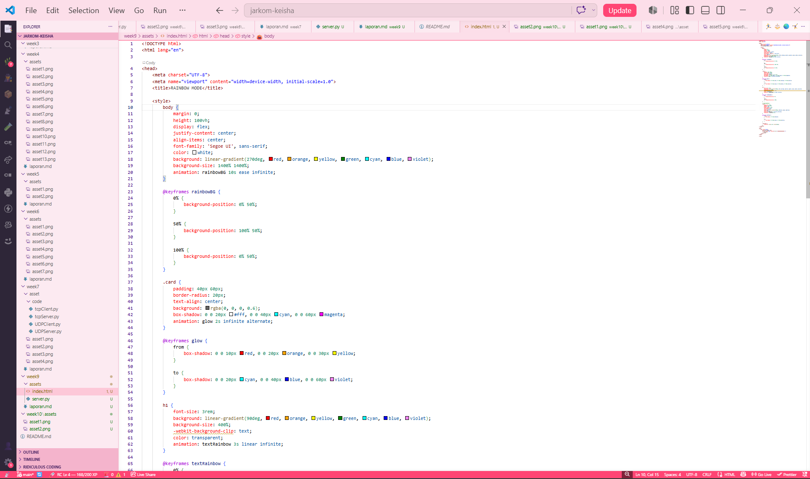
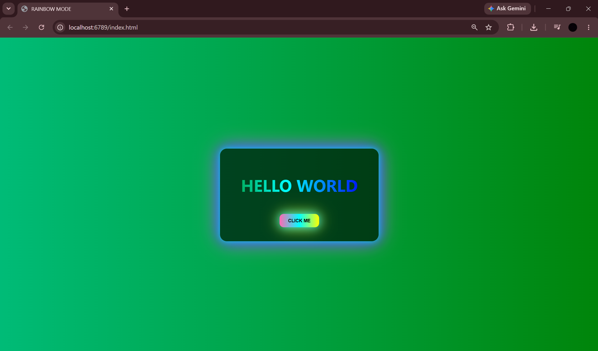
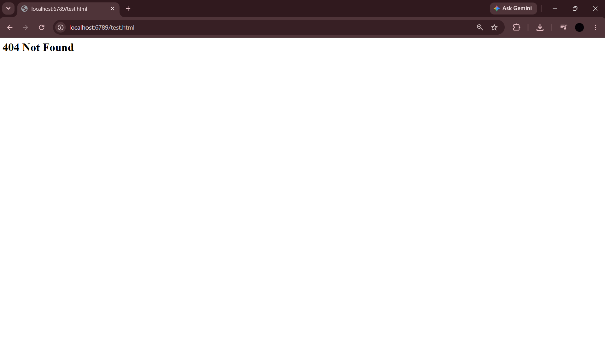

# Web Server

## Identitas

Nama: Keisha Hananta  
NIM: 103072400149  
Kelas: IF-04-01  

---

## Tujuan

Memahami dasar pemrograman socket TCP menggunakan Python.
Mempelajari cara kerja web server sederhana.
Mampu membuat web server yang menerima request HTTP dan mengirimkan response HTTP.
Mampu menampilkan halaman HTML serta mengirimkan pesan error 404 ketika file tidak ditemukan.
---

## Kode Program Web Server
**File:** `Server.py`

---

### HTML
**File:** `index.html`

---

## Metode
Membuat file HTML bernama index.html yang akan ditampilkan oleh web server.
Membuat program Server.py menggunakan library socket Python.
Mengatur server agar menggunakan protokol TCP dan melakukan binding pada port yang telah ditentukan.

Menjalankan server menggunakan perintah:

python Server.py

Membuka browser dan mengakses alamat:

http://localhost:6789/index.html
Mengamati apakah halaman HTML berhasil ditampilkan oleh browser.
Melakukan pengujian dengan meminta file yang tidak tersedia untuk memastikan server dapat mengirimkan pesan kesalahan 404 Not Found.
Mencatat hasil yang diperoleh selama pengujian.
---

## Hasil Analisis
Pada praktikum ini berhasil dibuat web server sederhana menggunakan socket TCP pada Python. Server dapat menerima koneksi dari browser dan memproses permintaan HTTP yang dikirimkan oleh client.

Ketika browser mengakses file index.html, server membaca isi file dari direktori kerja kemudian mengirimkan HTTP Response yang berisi status keberhasilan serta isi halaman HTML. Browser berhasil menampilkan halaman sesuai isi file yang tersedia.

Selain itu dilakukan pengujian dengan mengakses file yang tidak terdapat pada direktori server. Pada kondisi tersebut server mengirimkan pesan 404 Not Found sebagai tanda bahwa file yang diminta tidak tersedia. Browser kemudian menampilkan halaman error sesuai response yang diterima.

Dari hasil pengujian dapat diketahui bahwa komunikasi antara browser dan web server berlangsung menggunakan protokol HTTP yang berjalan di atas TCP. Socket bertugas menangani koneksi dan pertukaran data antara client dan server, sedangkan HTTP mengatur format request dan response yang digunakan.

---

## Kesimpulan

Web server sederhana dapat dibuat menggunakan Python dan TCP Socket Programming.
Server mampu menerima request HTTP dari browser dan mengirimkan response yang sesuai.
File HTML yang tersedia pada direktori server dapat ditampilkan melalui browser.
Server dapat menangani kesalahan dengan mengirimkan response 404 Not Found ketika file yang diminta tidak ditemukan.
Praktikum ini membantu memahami mekanisme dasar komunikasi client-server menggunakan HTTP dan TCP.