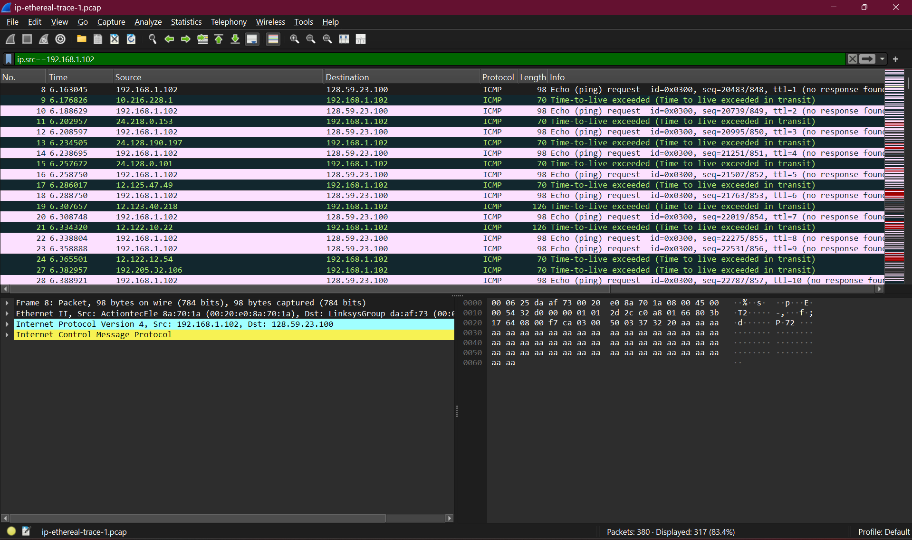
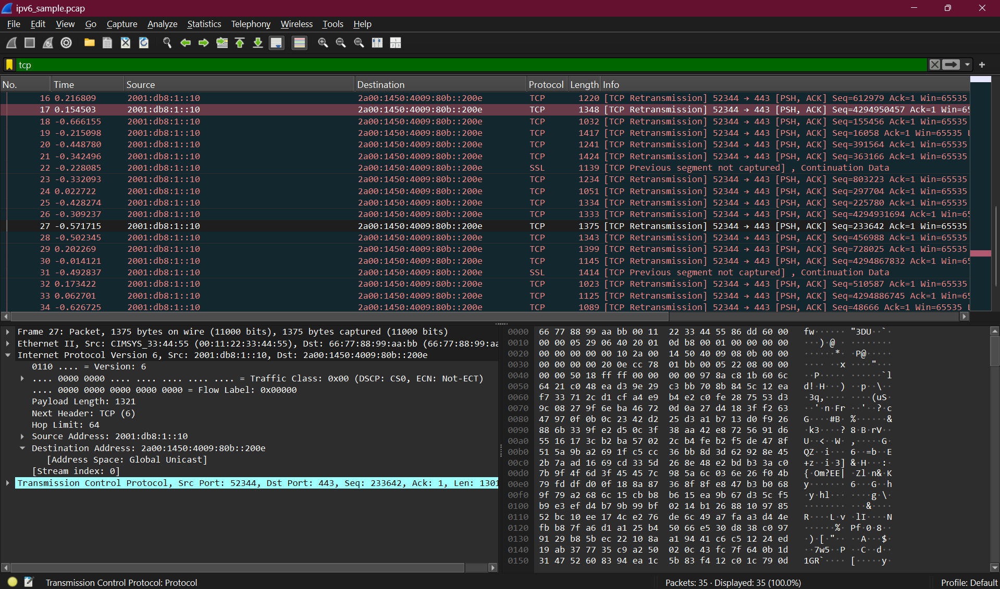

# Web Server

## Identitas

Nama: Keisha Hananta  
NIM: 103072400149  
Kelas: IF-04-01  

---

## Tujuan

Memahami struktur dasar paket IPv4.
Mengidentifikasi informasi yang terdapat pada header IP.
Memahami mekanisme fragmentasi pada IPv4.
Mengamati penggunaan IPv6 pada jaringan.
Menggunakan Wireshark untuk menganalisis paket IP.
---

## Metode
Membuka aplikasi Wireshark.
Memulai packet capture pada interface jaringan yang aktif.
Menjalankan traceroute/tracert ke tujuan yang ditentukan pada modul.
Menghentikan proses capture setelah traceroute selesai.
Menggunakan filter Wireshark untuk menampilkan paket IP yang relevan.
Mengamati informasi pada header IPv4 seperti:
Source Address
Destination Address
Time To Live (TTL)
Identification
Protocol
Mengamati proses fragmentasi paket apabila ukuran paket melebihi MTU.
Mengidentifikasi paket IPv6 yang muncul pada hasil capture.
Mendokumentasikan hasil pengamatan dan melakukan analisis.
---

## Hasil Analisis
## Analisis IPv4
Pada hasil capture Wireshark terlihat bahwa setiap paket IPv4 memiliki alamat sumber dan tujuan yang digunakan untuk proses routing antar perangkat jaringan. Header IPv4 juga memuat informasi TTL (Time To Live) yang akan berkurang setiap kali paket melewati router.

Field Identification digunakan untuk membedakan paket dan membantu proses penyusunan kembali apabila terjadi fragmentasi. Selain itu terdapat field Protocol yang menunjukkan protokol lapisan transport yang digunakan, seperti TCP atau UDP.
## Analisis Fragmentasi
Fragmentasi terjadi ketika ukuran paket lebih besar daripada Maximum Transmission Unit (MTU) yang dapat ditangani oleh suatu media jaringan. Paket akan dipecah menjadi beberapa fragmen yang masing-masing memiliki informasi Identification yang sama sehingga dapat disusun kembali oleh host tujuan.

Melalui Wireshark dapat diamati adanya field Fragment Offset dan More Fragments (MF) yang digunakan untuk menandai urutan fragmen dalam proses reassembly.
## Analisis IPv6
Pada hasil pengamatan ditemukan paket IPv6 yang menggunakan alamat 128-bit. IPv6 menyediakan ruang alamat yang jauh lebih besar dibandingkan IPv4 sehingga dapat mengatasi keterbatasan jumlah alamat IP.

Header IPv6 memiliki struktur yang lebih sederhana dibandingkan IPv4 dan tidak menggunakan checksum pada header. Selain itu proses fragmentasi pada IPv6 hanya dapat dilakukan oleh host pengirim, bukan oleh router di tengah jaringan.

---

## Kesimpulan

Paket IPv4 memiliki berbagai field penting seperti Source Address, Destination Address, TTL, dan Identification.
Nilai TTL berfungsi untuk mencegah paket beredar tanpa batas di jaringan.
Fragmentasi digunakan ketika ukuran paket melebihi MTU jaringan.
IPv6 menggunakan alamat 128-bit dan memiliki struktur header yang lebih sederhana dibandingkan IPv4.
Wireshark dapat digunakan untuk menganalisis detail paket IP serta mengamati proses komunikasi jaringan secara langsung.