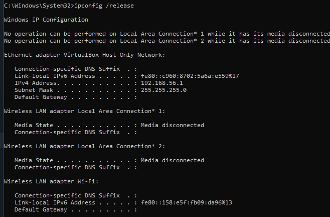
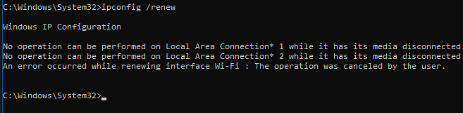
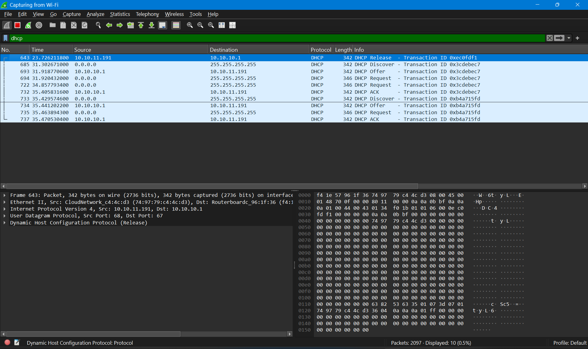

# DHCP

## Identitas

Nama: Keisha Hananta  
NIM: 103072400149  
Kelas: IF-04-01  


---

## Tujuan

Memahami cara kerja Dynamic Host Configuration Protocol (DHCP).

Mengamati proses pemberian alamat IP secara otomatis oleh DHCP Server.

Mengidentifikasi paket DHCP menggunakan Wireshark.

Memahami tahapan komunikasi DHCP yaitu Discover, Offer, Request, dan Acknowledge (DORA).

Menganalisis informasi yang terdapat pada paket DHCP.

---

## Metode

Membuka aplikasi Wireshark.

Memulai packet capture pada interface Wi-Fi yang aktif.

Membuka Command Prompt.

Menjalankan perintah:

```cmd
ipconfig /release
```


untuk melepaskan alamat IP yang sedang digunakan.

Menjalankan perintah:

```cmd
ipconfig /renew

```


untuk meminta alamat IP baru dari DHCP Server.

Menghentikan proses capture setelah proses DHCP selesai.

Menggunakan filter:

```text
dhcp

```


untuk menampilkan paket DHCP saja.

Mengamati urutan paket DHCP yang tertangkap pada Wireshark.

Mendokumentasikan hasil pengamatan dan melakukan analisis.

---

## Hasil Analisis

### Informasi Hasil Capture

DHCP Server : 10.10.10.1

DHCP Client : 10.10.11.191

Pada hasil capture Wireshark ditemukan paket DHCP berikut:

* DHCP Release
* DHCP Discover
* DHCP Offer
* DHCP Request
* DHCP ACK

Selain itu ditemukan proses DORA kedua yang menunjukkan client kembali melakukan permintaan konfigurasi jaringan kepada server DHCP.

### Analisis DHCP Release

Paket DHCP Release dikirim oleh client dengan alamat IP 10.10.11.191 kepada server DHCP 10.10.10.1.

Paket ini digunakan untuk memberitahukan bahwa alamat IP yang sebelumnya digunakan sudah tidak diperlukan lagi sehingga dapat dikembalikan ke server DHCP untuk digunakan oleh perangkat lain.

### Analisis DHCP Discover

DHCP Discover merupakan paket pertama dalam proses DORA.

Client yang belum memiliki alamat IP mengirimkan paket broadcast ke alamat 255.255.255.255 untuk mencari DHCP Server yang tersedia pada jaringan.

Pada tahap ini alamat sumber masih menggunakan 0.0.0.0 karena client belum mendapatkan konfigurasi IP.

### Analisis DHCP Offer

Setelah menerima DHCP Discover, server DHCP mengirimkan DHCP Offer kepada client.

Paket ini berisi penawaran alamat IP beserta konfigurasi jaringan lainnya seperti subnet mask, default gateway, DNS server, dan lease time.

Server DHCP yang memberikan penawaran pada hasil capture adalah 10.10.10.1.

### Analisis DHCP Request

Setelah menerima penawaran dari server, client mengirimkan DHCP Request.

Paket ini menunjukkan bahwa client menerima dan meminta penggunaan alamat IP yang ditawarkan oleh server DHCP.

Paket DHCP Request dikirim secara broadcast agar seluruh server DHCP mengetahui server mana yang dipilih oleh client.

### Analisis DHCP ACK

DHCP ACK (Acknowledge) merupakan tahap terakhir dalam proses DHCP.

Server DHCP mengirimkan pesan ACK kepada client sebagai tanda bahwa alamat IP telah disetujui dan dapat digunakan.

Setelah menerima DHCP ACK, client dapat menggunakan konfigurasi jaringan yang diberikan untuk berkomunikasi dengan perangkat lain pada jaringan.

### Analisis DORA

Berdasarkan hasil capture Wireshark, terlihat proses DORA (Discover, Offer, Request, Acknowledge) berlangsung dengan baik.

Urutan komunikasi yang terjadi adalah:

DHCP Discover → DHCP Offer → DHCP Request → DHCP ACK

Proses ini memungkinkan client memperoleh alamat IP dan konfigurasi jaringan secara otomatis tanpa perlu melakukan konfigurasi manual.

---

## Kesimpulan

DHCP digunakan untuk memberikan alamat IP dan konfigurasi jaringan secara otomatis kepada client.

Proses DHCP terdiri dari empat tahap utama yang dikenal sebagai DORA, yaitu Discover, Offer, Request, dan Acknowledge.

Pada hasil capture Wireshark ditemukan komunikasi DHCP antara client 10.10.11.191 dan server 10.10.10.1.

DHCP Release digunakan untuk melepaskan alamat IP yang sedang digunakan sebelum meminta alamat baru.

Wireshark dapat digunakan untuk mengamati dan menganalisis proses DHCP secara detail sehingga memudahkan pemahaman mekanisme pemberian alamat IP dalam jaringan.
