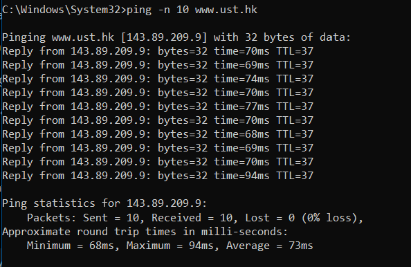
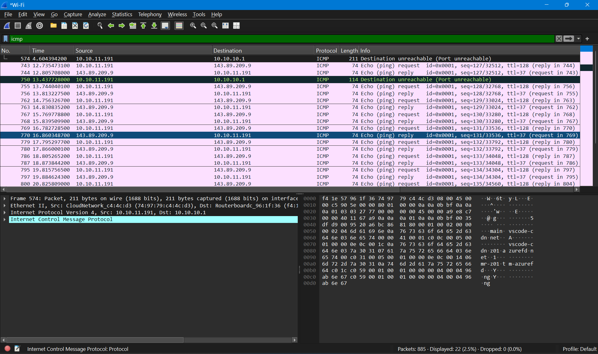
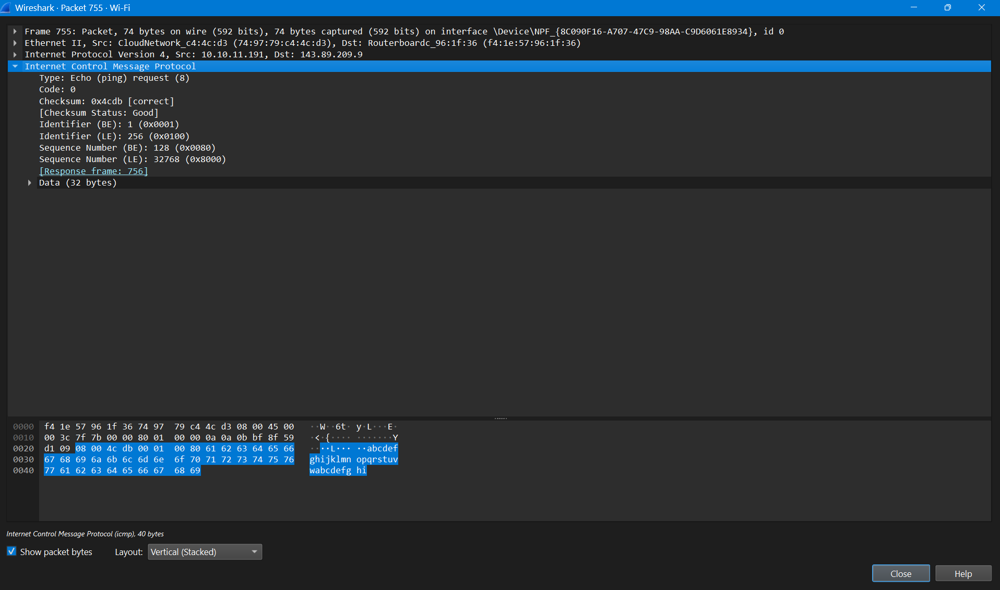
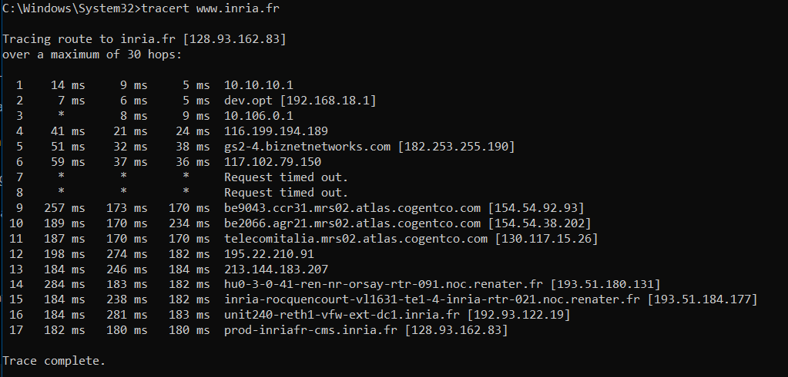
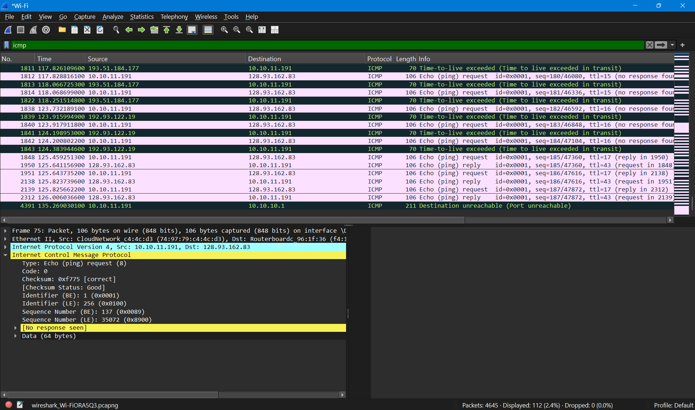
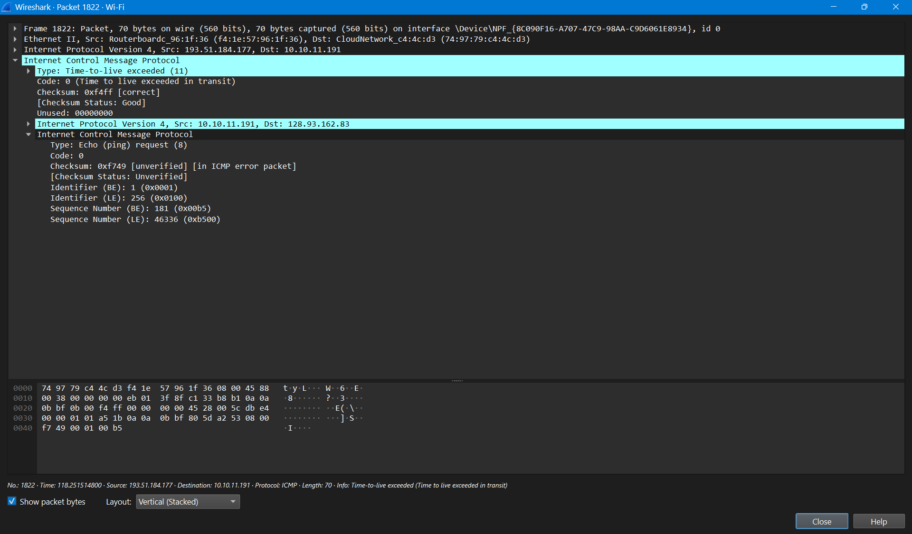

# ICMP dan Traceroute

## Identitas

Nama: Keisha Hananta
NIM: 103072400149
Kelas: IF-04-01

---

## Tujuan

Memahami cara kerja Internet Control Message Protocol (ICMP).

Mengamati komunikasi ICMP menggunakan Wireshark.

Memahami fungsi Ping dalam menguji konektivitas jaringan.

Memahami fungsi Traceroute dalam menentukan jalur paket menuju host tujuan.

Menganalisis paket ICMP Echo Request, Echo Reply, dan Time Exceeded.

---

## Metode

Membuka aplikasi Wireshark.

Memulai packet capture pada interface Wi-Fi yang aktif.

Membuka Command Prompt.

Menjalankan perintah:

```cmd
ping -n 10 www.ust.hk
```



untuk menguji konektivitas jaringan menggunakan protokol ICMP.

Menghentikan proses capture setelah Ping selesai.

Menggunakan filter:

```text
icmp
```



untuk menampilkan paket ICMP yang tertangkap.

Melakukan packet capture kembali pada Wireshark.

Menjalankan perintah:

```cmd
tracert www.inria.fr
```



untuk mengetahui jalur paket menuju host tujuan.

Menghentikan proses capture setelah Traceroute selesai.

Menggunakan filter:

```text
icmp
```



untuk menampilkan paket ICMP selama proses Traceroute.

Mengamati paket Echo Request, Echo Reply, dan Time Exceeded.

Mendokumentasikan hasil pengamatan dan melakukan analisis.

---

## Hasil Analisis

### Informasi Hasil Capture Ping

Host tujuan : [www.ust.hk](http://www.ust.hk)

Alamat IP tujuan : 143.89.209.9

Alamat IP client : 10.10.11.191

Pada hasil capture Wireshark ditemukan paket:

* ICMP Echo Request
* ICMP Echo Reply

Berdasarkan hasil Ping diperoleh:

* Packets Sent = 10
* Packets Received = 10
* Packet Loss = 0%
* Minimum RTT = 68 ms
* Maximum RTT = 94 ms
* Average RTT = 73 ms

### Analisis ICMP Echo Request

Paket ICMP Echo Request dikirim oleh host 10.10.11.191 menuju host 143.89.209.9.

Berdasarkan hasil pengamatan pada Wireshark diperoleh:

* Type = 8
* Code = 0
* Identifier = 0x0001

Type 8 menunjukkan bahwa paket tersebut merupakan Echo Request yang digunakan oleh utilitas Ping untuk memeriksa apakah host tujuan dapat dijangkau.

### Analisis ICMP Echo Reply

Setelah menerima Echo Request, host tujuan mengirimkan Echo Reply sebagai balasan.

Berdasarkan hasil capture terlihat bahwa seluruh Echo Request memperoleh Echo Reply sehingga tidak terjadi packet loss selama proses pengujian.

Pada paket Echo Reply diperoleh:

* Type = 0
* Code = 0

Balasan tersebut menunjukkan bahwa host tujuan aktif dan dapat berkomunikasi dengan host pengirim.

### Analisis Ping

Berdasarkan hasil pengujian, komunikasi antara client 10.10.11.191 dan server 143.89.209.9 berlangsung dengan baik.

Seluruh 10 paket berhasil diterima kembali sehingga tingkat keberhasilan komunikasi mencapai 100%.

Nilai rata-rata RTT sebesar 73 ms menunjukkan waktu tempuh paket dari host pengirim menuju host tujuan dan kembali lagi ke host pengirim.

---

### Informasi Hasil Capture Traceroute

Host tujuan : [www.inria.fr](http://www.inria.fr)

Alamat IP tujuan : 128.93.162.83

Alamat IP client : 10.10.11.191

Pada hasil capture ditemukan paket:

* ICMP Echo Request
* ICMP Time Exceeded
* ICMP Echo Reply

Traceroute berhasil mencapai tujuan setelah melewati 17 hop.

Beberapa hop tidak memberikan respons sehingga ditampilkan sebagai:

```text
Request timed out.
```


Hal ini umum terjadi karena beberapa router dikonfigurasi untuk tidak merespons paket traceroute.

### Analisis ICMP Time Exceeded

Pada hasil Wireshark ditemukan paket:

* Type = 11
* Code = 0

yang menunjukkan pesan:

```text
Time-to-live exceeded in transit
```

Paket tersebut dikirim oleh router:

```text
193.51.184.177
```

menuju client:

```text
10.10.11.191
```


Pesan ini muncul karena nilai TTL paket telah mencapai nol sebelum mencapai tujuan akhir.

Router kemudian membuang paket dan mengirimkan pesan ICMP Time Exceeded kepada pengirim.

### Analisis Traceroute

Traceroute bekerja dengan mengirim paket menggunakan nilai TTL yang terus bertambah.

Ketika TTL habis pada suatu router, router tersebut mengirimkan pesan ICMP Time Exceeded.

Melalui mekanisme tersebut dapat diketahui jalur yang dilalui paket menuju host tujuan.

Berdasarkan hasil pengamatan diperoleh beberapa hop penting:

* 10.10.10.1
* 192.168.18.1
* 182.253.255.190
* 154.54.92.93
* 193.51.180.131
* 193.51.184.177
* 192.93.122.19
* 128.93.162.83

Host tujuan berhasil dicapai pada hop ke-17.

### Analisis ICMP Secara Keseluruhan

ICMP digunakan sebagai protokol pendukung pada lapisan jaringan untuk memberikan informasi mengenai kondisi jaringan.

Pada praktikum ini ICMP digunakan untuk:

* Menguji konektivitas jaringan melalui Ping.
* Menentukan jalur paket melalui Traceroute.
* Memberikan informasi kesalahan melalui pesan Time Exceeded.

Melalui Wireshark dapat diamati bahwa setiap proses diagnostik jaringan memanfaatkan paket ICMP sebagai sarana komunikasi antar perangkat jaringan.

---

## Kesimpulan

ICMP merupakan protokol yang digunakan untuk membantu proses diagnostik dan pemantauan jaringan.

Pada percobaan Ping, komunikasi antara host 10.10.11.191 dan server 143.89.209.9 berjalan dengan baik dengan tingkat keberhasilan 100% dan rata-rata RTT sebesar 73 ms.

Pada percobaan Traceroute, paket berhasil mencapai host tujuan 128.93.162.83 setelah melewati 17 hop.

Pesan ICMP Time Exceeded yang ditemukan pada Wireshark menunjukkan mekanisme TTL yang digunakan Traceroute untuk mengidentifikasi router yang dilewati paket.

Wireshark sangat membantu dalam memahami cara kerja ICMP karena mampu menampilkan detail paket Echo Request, Echo Reply, dan Time Exceeded secara langsung.
