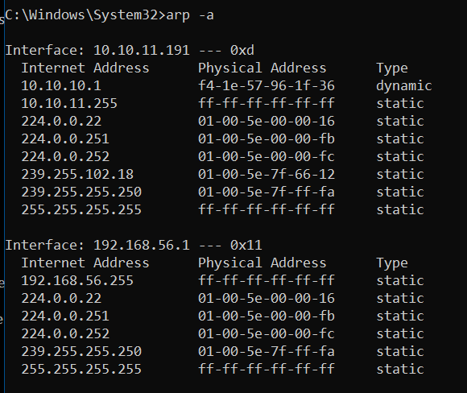
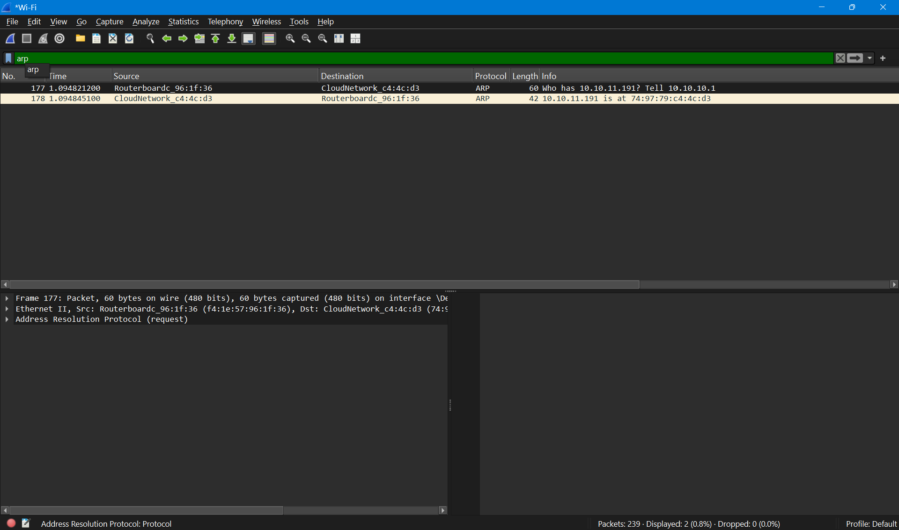

# Ethernet dan ARP

## Identitas

Nama: Keisha Hananta
NIM: 103072400149
Kelas: IF-04-01

---

## Tujuan

Memahami cara kerja Ethernet.

Memahami fungsi Address Resolution Protocol (ARP).

Mengamati komunikasi ARP menggunakan Wireshark.

Mengidentifikasi format frame Ethernet dan paket ARP.

Menganalisis hubungan antara alamat IP dan alamat MAC pada jaringan.

---

## Metode

Membuka aplikasi Wireshark.

Menjalankan perintah:

```cmd
arp -a
```



untuk melihat isi ARP cache pada komputer.

Menjalankan Command Prompt sebagai Administrator.

Menjalankan perintah:

```cmd
arp -d *
```


untuk menghapus seluruh isi ARP cache.

Memulai packet capture pada Wireshark.

Membuka browser dan mengakses:

```text
http://gaia.cs.umass.edu/wireshark-labs/HTTP-wireshark-lab-file3.html
```

Menghentikan proses capture setelah halaman berhasil dimuat.

Menggunakan filter:

```text
arp
```



untuk menampilkan paket ARP saja.

Mengamati paket ARP Request dan ARP Reply.

Menganalisis detail frame Ethernet dan paket ARP.

---

## Hasil Analisis

### Informasi Hasil Capture

Client IP Address : 10.10.11.191

Client MAC Address : 74:97:79:c4:4c:d3

Gateway IP Address : 10.10.10.1

Gateway MAC Address : f4:1e:57:96:1f:36

Pada hasil capture ditemukan dua paket utama:

* ARP Request
* ARP Reply

---

### Analisis ARP Cache

Sebelum penghapusan cache, perintah:

```cmd
arp -a
```

menampilkan beberapa pasangan alamat IP dan alamat MAC yang tersimpan pada komputer.

Salah satu entri yang ditemukan adalah:

IP Address:

```text
10.10.10.1
```

MAC Address:

```text
f4-1e-57-96-1f-36
```

dengan tipe dynamic yang menunjukkan bahwa alamat tersebut diperoleh secara otomatis melalui proses ARP.

---

### Analisis ARP Request

Pada paket ARP Request ditemukan informasi:

* Opcode = 1 (Request)
* Sender IP Address = 10.10.10.1
* Sender MAC Address = f4:1e:57:96:1f:36
* Target IP Address = 10.10.11.191
* Target MAC Address = 00:00:00:00:00:00

Pesan yang dikirim adalah:

```text
Who has 10.10.11.191? Tell 10.10.10.1
```

Paket ini dikirim oleh gateway untuk mengetahui alamat MAC dari perangkat dengan alamat IP 10.10.11.191.

Karena alamat MAC tujuan belum diketahui, bagian Target MAC Address masih bernilai 00:00:00:00:00:00.

---

### Analisis ARP Reply

Pada paket ARP Reply ditemukan informasi:

* Opcode = 2 (Reply)
* Sender IP Address = 10.10.11.191
* Sender MAC Address = 74:97:79:c4:4c:d3
* Target IP Address = 10.10.10.1
* Target MAC Address = f4:1e:57:96:1f:36

Pesan yang dikirim adalah:

```text
10.10.11.191 is at 74:97:79:c4:4c:d3
```

Paket ini merupakan balasan dari perangkat yang memiliki alamat IP 10.10.11.191 untuk memberitahukan alamat MAC miliknya kepada gateway.

Setelah menerima ARP Reply, gateway dapat menyimpan pasangan alamat IP dan MAC tersebut ke dalam ARP cache.

---

### Analisis Ethernet II

Pada frame Ethernet ditemukan informasi:

Source MAC Address:

```text
f4:1e:57:96:1f:36
```

Destination MAC Address:

```text
74:97:79:c4:4c:d3
```

Ethernet berfungsi sebagai protokol lapisan data link yang bertanggung jawab mengirim frame berdasarkan alamat MAC.

Alamat MAC digunakan agar frame dapat dikirim ke perangkat tujuan yang tepat dalam jaringan lokal.

---

### Analisis Hubungan Ethernet dan ARP

ARP digunakan untuk menerjemahkan alamat IP menjadi alamat MAC.

Ethernet membutuhkan alamat MAC tujuan sebelum frame dapat dikirim.

Karena itu ARP berperan penting dalam proses komunikasi jaringan lokal.

Urutan komunikasi yang terjadi adalah:

ARP Request → ARP Reply → Penyimpanan ke ARP Cache → Pengiriman Frame Ethernet

Melalui proses tersebut perangkat dapat mengetahui alamat MAC tujuan dan mengirimkan data menggunakan frame Ethernet.

---

## Kesimpulan

ARP digunakan untuk menerjemahkan alamat IP menjadi alamat MAC dalam jaringan lokal.

Pada hasil capture ditemukan komunikasi ARP antara gateway 10.10.10.1 dan client 10.10.11.191.

ARP Request digunakan untuk mencari alamat MAC dari suatu alamat IP, sedangkan ARP Reply digunakan untuk memberikan informasi alamat MAC yang diminta.

Ethernet menggunakan alamat MAC sebagai identitas perangkat pada lapisan data link sehingga proses komunikasi dalam jaringan lokal dapat berlangsung dengan benar.

Wireshark memudahkan proses analisis Ethernet dan ARP karena mampu menampilkan detail frame dan paket yang dikirimkan antar perangkat.
