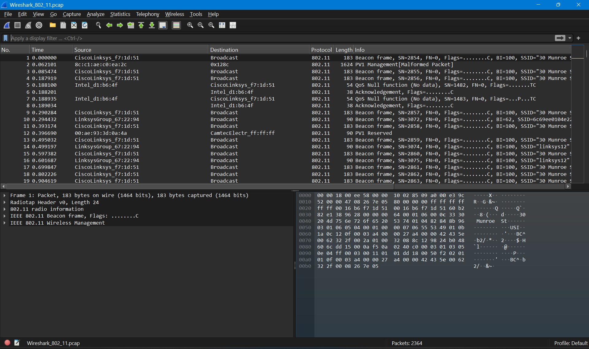
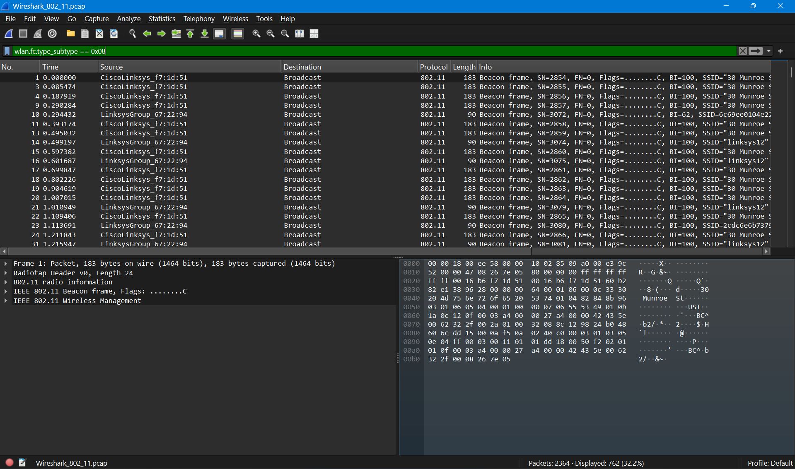
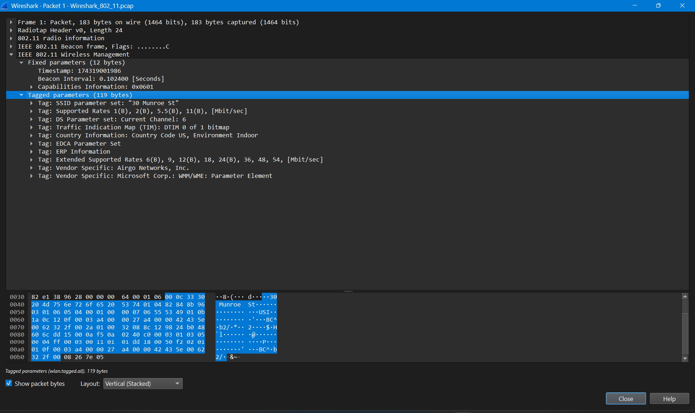
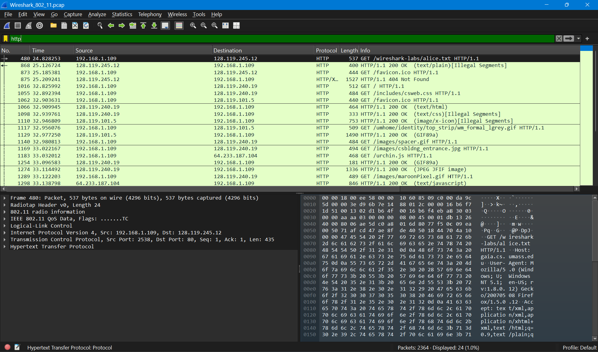
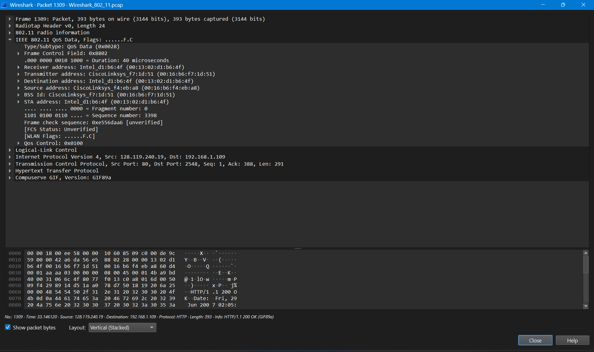
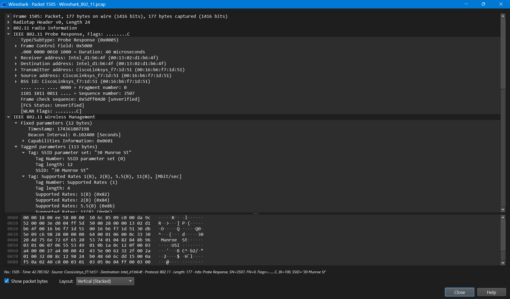
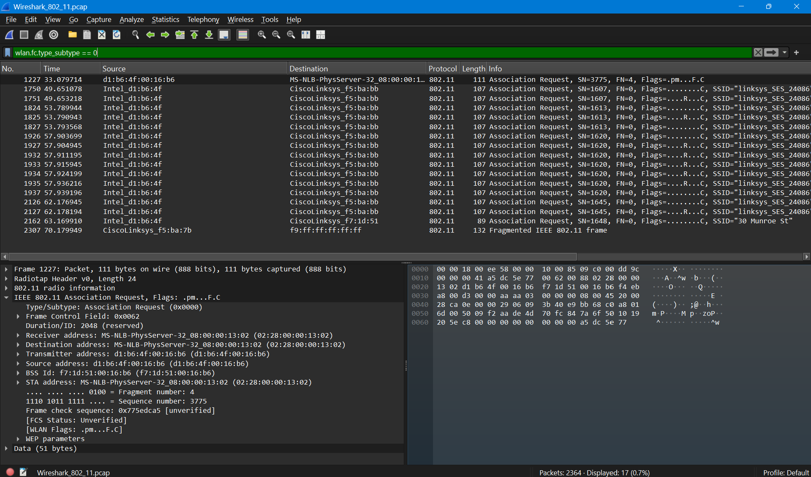

# IEEE 802.11 (WiFi)

## Identitas

Nama: Keisha Hananta
NIM: 103072400149
Kelas: IF-04-01

---

## Tujuan

Memahami cara kerja protokol IEEE 802.11 (WiFi).

Mengamati struktur frame pada jaringan nirkabel menggunakan Wireshark.

Mengidentifikasi frame Management dan Data pada jaringan WiFi.

Menganalisis Beacon Frame, Probe Response, dan Association Request.

Memahami proses pertukaran data HTTP melalui jaringan IEEE 802.11.

---

## Metode

Membuka aplikasi Wireshark.

Membuka file capture:

```text
Wireshark_802_11.pcap
```



Mengamati seluruh paket yang terdapat pada file capture.

Menggunakan filter:

```text
wlan.fc.type_subtype == 0x08
```



untuk menampilkan Beacon Frame.

Memilih salah satu paket Beacon dan melihat detail paket.



Menggunakan filter:

```text
http
```



untuk menampilkan paket HTTP.

Memilih salah satu paket HTTP dan mengamati struktur frame IEEE 802.11 Data.



Menggunakan filter untuk mencari Probe Response.



Menggunakan filter:

```text
wlan.fc.type_subtype == 0
```



untuk menampilkan Association Request.

Menganalisis informasi yang terdapat pada masing-masing frame.

---

## Hasil Analisis

### Informasi Hasil Capture

SSID Access Point:

```text
30 Munroe St
```

Channel:

```text
6
```

Pada hasil capture ditemukan beberapa jenis frame IEEE 802.11 yaitu:

* Beacon Frame
* Probe Response
* Association Request
* QoS Data Frame
* HTTP Traffic

---

### Analisis Beacon Frame

Pada paket Beacon ditemukan informasi:

* SSID = 30 Munroe St
* Beacon Interval = 0.102400 seconds
* Capability Information = 0x0601
* Channel = 6


Beacon Frame merupakan Management Frame yang dikirim secara berkala oleh Access Point untuk mengumumkan keberadaan jaringan WiFi kepada perangkat di sekitarnya.

Informasi yang dibawa meliputi nama jaringan (SSID), channel yang digunakan, kemampuan jaringan, serta kecepatan transmisi yang didukung.

---

### Analisis HTTP pada IEEE 802.11

Pada paket HTTP ditemukan informasi:

* Source IP = 192.168.1.109
* Destination IP = 128.119.245.12
* Protocol = HTTP
* Method = GET


Frame HTTP dibawa oleh IEEE 802.11 QoS Data Frame yang kemudian diteruskan ke protokol IP, TCP, dan HTTP.

---

### Analisis QoS Data Frame

Pada detail paket HTTP terlihat struktur:

```text
IEEE 802.11 QoS Data
├── MAC Header
├── Logical-Link Control (LLC)
├── IPv4
├── TCP
└── HTTP
```


Berbeda dengan Ethernet biasa, frame IEEE 802.11 memiliki informasi tambahan yang digunakan untuk komunikasi jaringan nirkabel.

Frame Data digunakan untuk mengirimkan data pengguna seperti HTTP, TCP, dan IP melalui jaringan WiFi.

---

### Analisis Probe Response

Pada paket Probe Response ditemukan informasi:

* Type/Subtype = Probe Response
* SSID = 30 Munroe St
* Beacon Interval = 0.102400 seconds
* Capability Information = 0x0601


Probe Response merupakan frame Management yang dikirim oleh Access Point sebagai balasan terhadap Probe Request yang dikirim oleh perangkat klien.

Frame ini memberikan informasi mengenai jaringan WiFi yang tersedia sehingga klien dapat menentukan Access Point yang akan digunakan.

---

### Analisis Association Request

Pada paket Association Request ditemukan informasi:

* Type/Subtype = Association Request
* SSID = 30 Munroe St
* Client = Intel_d1:b6:4f
* Access Point = CiscoLinksys_f7:1d:51


Association Request digunakan oleh perangkat klien untuk meminta izin bergabung ke jaringan WiFi.

Setelah Association Request diterima dan disetujui oleh Access Point, perangkat dapat mulai melakukan komunikasi data melalui jaringan tersebut.

---

### Analisis Hubungan Antar Frame

Urutan komunikasi yang terlihat pada capture adalah:

```text
Beacon Frame -> Probe Response -> Association Request -> QoS Data Frame -> HTTP Communication
```

Beacon digunakan untuk mengumumkan jaringan.

Probe Response digunakan untuk memberikan informasi jaringan kepada klien.

Association Request digunakan untuk membangun koneksi dengan Access Point.

Setelah koneksi berhasil terbentuk, pertukaran data dilakukan menggunakan Data Frame IEEE 802.11 yang membawa paket HTTP.

---

## Kesimpulan

IEEE 802.11 merupakan standar komunikasi jaringan nirkabel yang menggunakan berbagai jenis frame untuk mendukung proses komunikasi.

Pada hasil capture ditemukan Beacon Frame, Probe Response, Association Request, dan QoS Data Frame yang membawa paket HTTP.

Beacon Frame digunakan untuk mengumumkan keberadaan jaringan WiFi, sedangkan Probe Response dan Association Request digunakan dalam proses koneksi antara klien dan Access Point.

Setelah proses asosiasi berhasil, data dapat ditransmisikan menggunakan IEEE 802.11 Data Frame.

Wireshark memudahkan proses analisis jaringan WiFi karena mampu menampilkan detail setiap frame IEEE 802.11 secara lengkap.
