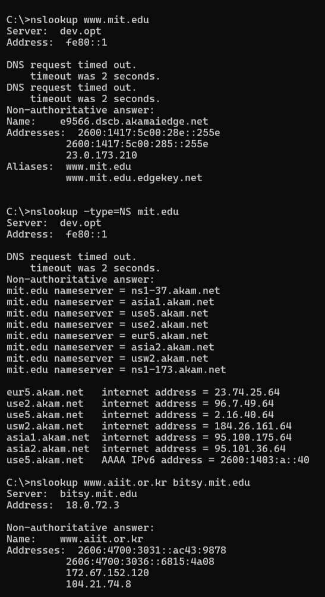
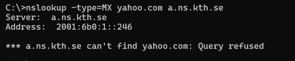
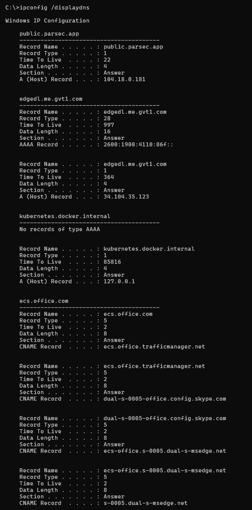
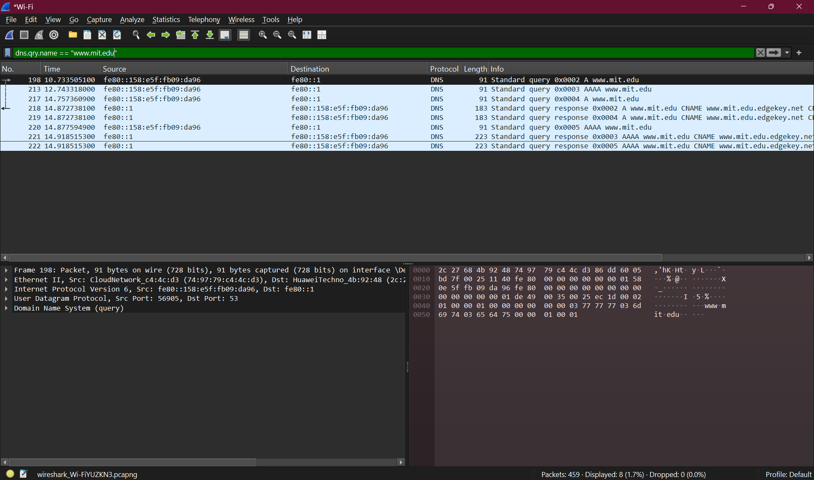
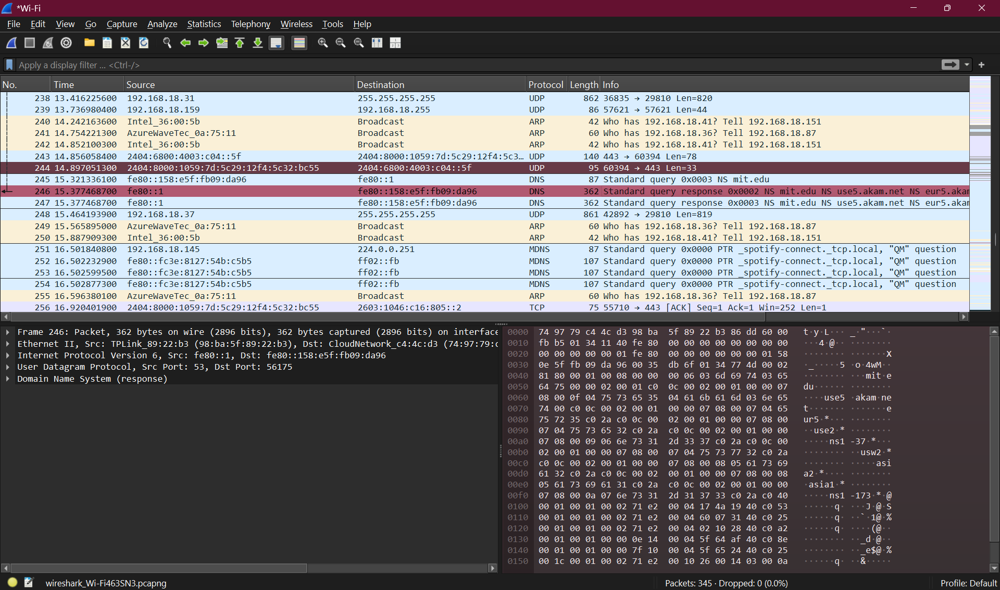

# Analisis Protokol DNS - Wireshark

## Identitas

Nama: Keisha Hananta  
NIM: 103072400149  
Kelas: IF-04-01  

---

## 4.1 Pengantar

DNS (Domain Name System) berfungsi untuk menerjemahkan nama domain menjadi alamat IP.  
Client akan mengirim permintaan ke server DNS dan menerima balasan berupa alamat IP.  

---

## 4.2 Nslookup

### Perintah 1: Mencari IP domain

```bash
nslookup www.mit.edu
```


---

### Perintah 2: Mencari DNS server otoritatif

```bash
nslookup -type=NS mit.edu
```

---

### Perintah 3: Query ke DNS tertentu

```bash
nslookup www.aiit.or.kr bitsy.mit.edu
```



---
### Analisa
web asia(tokyo)
```bash
nslookup -type=NS www.u-tokyo.ac.jp
```


web eropa (sweden)
```bash
nslookup -type=NS www.kth.se
```


Yahoo (query refused)
```bash
nslookup -type=MX yahoo.com a.ns.kth.se
```


Yahoo
```bash
nslookup -type=MX yahoo.com
```

---

## 4.3 Ipconfig

### Menampilkan informasi jaringan

```bash
ipconfig /all
```


---

### Menampilkan cache DNS

```bash
ipconfig /displaydns
```



---

### Menghapus cache DNS

```bash
ipconfig /flushdns
```


---

## 4.4 Tracing DNS dengan Wireshark

### Langkah 1: Bersihkan DNS cache

```bash
ipconfig /flushdns
```


---

### Langkah 2: Jalankan Wireshark dan set filter

```
ip.addr == [IP address]
```


---

### Langkah 3: Start capture lalu akses website

```
http://www.ietf.org
```


---

### Langkah 4: Stop capture dan filter DNS

```
dns
```


---

### Langkah 5: Nslookup dengan Wireshark

```bash
nslookup www.mit.edu
```



---

### Langkah 6: Nslookup type NS

```bash
nslookup -type=NS mit.edu
```



---

### Langkah 7: Nslookup ke server tertentu

```bash
nslookup www.aiit.or.kr bitsy.mit.edu
```


---
