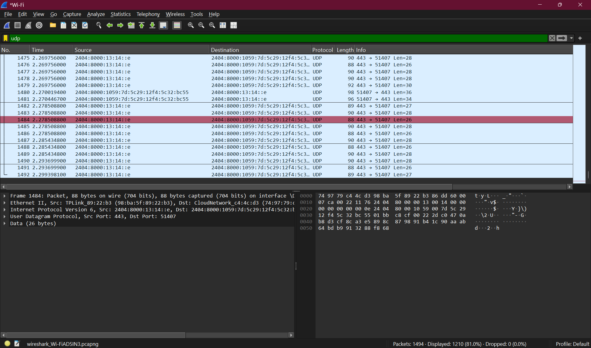

# UDP

## Identitas

Nama: Keisha Hananta
NIM: 103072400149
Kelas: IF-04-01

---

## Tujuan
Tujuan Praktikum:

Memahami cara kerja protokol UDP (User Datagram Protocol)
Menganalisis struktur paket UDP menggunakan Wireshark
Mengidentifikasi field-field yang terdapat pada header UDP
Memahami hubungan antara header dan payload dalam komunikasi jaringan
---

## Dasar Teori
UDP (User Datagram Protocol) merupakan protokol pada layer transport yang bersifat:

Connectionless (tidak perlu koneksi terlebih dahulu)
Tidak reliabel (tidak menjamin pengiriman data)
Cepat dan ringan

Struktur header UDP terdiri dari 4 field utama:

Source Port (2 byte)
Destination Port (2 byte)
Length (2 byte)
Checksum (2 byte)

Total header UDP = 8 byte

UDP sering digunakan pada:

DNS
Streaming
Game online
VoIP
---

## Metode
Langkah-langkah yang dilakukan:

Membuka aplikasi Wireshark
Memilih interface jaringan (Wi-Fi)
Memulai proses capture paket
Mengakses website (misalnya Google) untuk menghasilkan trafik
Menghentikan capture

Memfilter paket menggunakan filter:

udp
Memilih salah satu paket UDP untuk dianalisis

---
## Hasil Analisis
## 1.Field pada header UDP

Pada paket yang dianalisis, terdapat 4 field utama pada header UDP, yaitu:
Source Port
Destination Port
Length
Checksum

Jumlah field = 4

## 2.Panjang masing-masing field UDP

Setiap field memiliki panjang:

Source Port = 2 byte
Destination Port = 2 byte
Length = 2 byte
Checksum = 2 byte

Total header UDP = 8 byte
## 3.Arti field “Length”

Field Length menyatakan:

Total panjang paket UDP (header + data/payload)

Pada hasil Wireshark:

Length = 34 byte

## 4.Maksimum payload UDP

Diketahui:

Maksimum ukuran UDP = 65535 byte
Header UDP = 8 byte

Maksimum payload = 65535 - 8 = 65527 byte

## 5.Nomor port sumber

Dari paket:

Source Port = 443

## 6.Nomor protokol UDP

Dari bagian IP:

Next Header: UDP (17)
Jadi:
Desimal = 17
Hex = 0x11

## 7.Analisis pasangan paket UDP

Pada paket yang diamati:

Paket dikirim dari:
Port 443 → 51407

Untuk menemukan balasan:
Cari paket dengan:
Port 51407 → 443
IP tujuan ↔ IP sumber terbalik

Artinya:
Paket kedua adalah response dari paket pertama
---

## Kesimpulan

